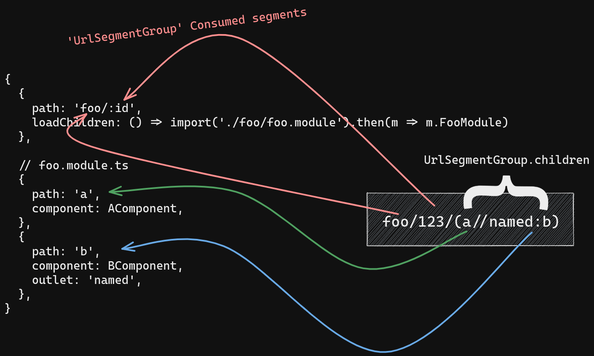
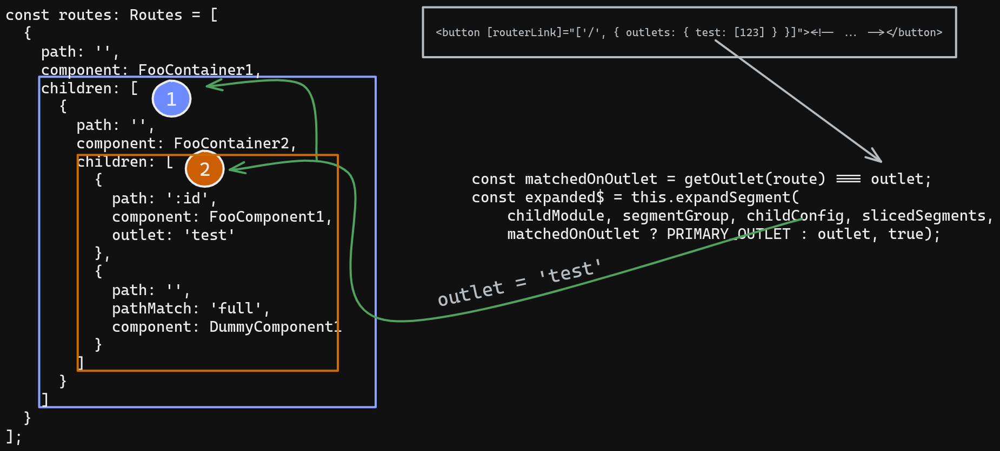

In this article, we are going to highlight the importance of a fix that came with the 11th version of Angular Router. We will do so by examining a scenario where the lack of that fix prevents an intuitive solution from working, as well as understanding why the fix in question solves the problem.  
The reader doesn't need to have more than a basic knowledge of Angular Router. Although we will make use of some *advanced* concepts like `UrlTree`, `UrlSegmentGroup`, they will be briefly described before being applied.  

*This article has been inspired by [this Stack Overflow question](https://stackoverflow.com/questions/68109583/passing-parameters-in-named-outlets-is-not-working/68137662#68137662).*

Throughout the article we will not be using the example from the aforementioned Stack Overflow question. Instead, it will be a simpler example, so that it can better illustrate the problem we are trying to solve. Before going any further, we must be aware of how Angular Router resolves routes transitions. For that, we'll have to introduce the notion of `UrlTree`.

## UrlTree

Given a URL string, it will be converted into an equivalent `UrlTree`, which Angular Router will further use to determine whether a configuration exists or not for that route. It can achieve that by traversing the given `Routes` configuration array and the `UrlTree` simultaneously. This is how the `UrlTree` structure looks like:

```typescript
export class UrlTree {
/* ... */
constructor(
  /** The root segment group of the URL tree */
  public root: UrlSegmentGroup,
  /** The query params of the URL */
  public queryParams: Params,
  /** The fragment of the URL */
  public fragment: string|null) {}
}
```

as you can probably see, it already resembles a URL, since it has properties like `queryParams` and `fragment`. It looks like only the **segments** of a URL are missing. For that, there is `UrlSegmentGroup`, which looks as follows:

```typescript
export class UrlSegmentGroup {
  /* ... */
  parent: UrlSegmentGroup|null = null;

  constructor(
    /** The URL segments of this group. See `UrlSegment` for more information */
    public segments: UrlSegment[],
    /** The list of children of this group */
    public children: {[key: string]: UrlSegmentGroup}) {
    forEach(children, (v: any, k: any) => v.parent = this);
  }
}
```

and with this we can understand why it's called a `UrlTree`, because a URL can apparently be seen as a **tree of segments**. Now it comes the genuine question: why would you need a tree-like structure to represent the segments of a URL? The answer is because Angular Router also supports **named outlets** and in fact, every property from the `children` object form above represents a named outlet. It should also be mentioned that when no outlet is specified, the **primary outlet** is used by default.  
A `UrlSegment` is used to represent a URL segment and for each segment it keeps track of the **name** and the **segment parameters**.  
Let's see an example: given the URL `'foo/123/(a//named:b)'`(where `named` refers to a named outlet called `named`), its equivalent `UrlTree` will be:

```typescript
{
  segments: [], // The root UrlSegmentGroup never has any segments
  children: {
    primary: {
      segments: [{ path: 'foo', parameters: {} }, { path: '123', parameters: {} }],
      children: {
        primary: { segments: [{ path: 'a', parameters: {} }], children: {} },
        named: { segments: [{ path: 'b', parameters: {} }], children: {} },
      },
    },
  },
}
```

A structure like the one from above is then used when traversing the `Routes` configuration array. A configuration that would match the given URL would be this one:

```typescript
{
  // app-routing.module.ts
  {
    path: 'foo/:id',
    loadChildren: () => import('./foo/foo.module').then(m => m.FooModule)
  },
​
  // foo.module.ts
  {
    path: 'a',
    component: AComponent,
  },
  {
    path: 'b',
    component: BComponent,
    outlet: 'named',
  },
}
```

*You can try out the above example [here](https://stackblitz.com/edit/routing-base-url-parser?file=src%2Fapp%2Fapp.module.ts).*

Now that we grasped the fundamentals of `UrlTree`, it's time to see the problem we are trying to solve.

*If you'd like to read more about `UrlTree`, I'd recommend having a look at [Angular Router: Getting to know UrlTree, ActivatedRouteSnapshot and ActivatedRoute](https://andreigatej.dev/blog/angular-router-urlree).*

## The problem

Suppose you are given a configuration that looks like this:

```typescript
const routes: Routes = [
  {
    path: '',
    component: FooContainer1,
    children: [
      {
        path: '',
        component: FooContainer2,
        children: [
          {
            path: ':id',
            component: FooComponent1,
            outlet: 'test'
          },
          {
            path: '',
            pathMatch: 'full',
            component: DummyComponent1
          }
        ]
      }
    ]
  }
];
```

Can you think of a URL that would activate the `FooComponent1` component?

If your answer is

```html
<button [routerLink]="['/', { outlets: { test: [123] } }]"><!-- ... --></button>
```

then, whether you are correct or not depends on which version of Angular you're using. In both cases, the `UrlTree` of the above is:

```typescript
{
  fragment: undefined
  queryParams: {}
  root: {
    children:
      test: {
        children: {}
        segments: [{ path: '123' }]
      }
    segments: []
  }
}
```

In Angular versions earlier than 11, the above solution won't work and we will have to find another approach. In Angular 11 this is fixed. Let's see each case in detail.

### The process of matching `Routes` with `UrlSegmentGroup`s

It is now worth talking about the *matching process* between `Routes` configuration and a `UrlSegmentGroup`.  
The number of segments(delimited by `/`) in the `Route`'s `path` property does not have to be equal to the number of `UrlSegmentGroup.segments`. In order for a `Route` to be matched, the numbers of segments in the `path` property must be less than or equal to the length of `UrlSegmentGroup.segments`. If the previous condition is met, the some of the `UrlSegmentGroup.segments` segments are said to be *consumed*.

The [same logic](https://github.com/angular/angular/blob/bbeac0727b8f267a47aba1ff1bcfc8cc5ca15b61/packages/router/src/recognize.ts#L185-L191) applies in case of `{ path: '', }`:

```typescript
if (route.path === '') {
  if (route.pathMatch === 'full' && (segmentGroup.hasChildren() || segments.length > 0)) {
    throw new NoMatch();
  }

  return {consumedSegments: [], lastChild: 0, parameters: {}};
}
```

It was necessary to briefly introduce this notion because, based on the *consumed segments*, there will be 3 cases:

1. All the `UrlSegmentGroup.segments` are consumed **and** `UrlSegmentGroup.children` is not empty:

An example of this is even the one we have seen at the beginning of this article:

<div style="text-align: center;">
  
</div>

```typescript
// The `UrlTree`
{
  segments: [], // The root UrlSegmentGroup never has any segments
  children: {
    primary: {
      segments: [{ path: 'foo', parameters: {} }, { path: '123', parameters: {} }],
      children: {
        primary: { segments: [{ path: 'a', parameters: {} }], children: {} },
        named: { segments: [{ path: 'b', parameters: {} }], children: {} },
      },
    },
  },
}

// The configuration
{
  // app-routing.module.ts
  {
    path: 'foo/:id',
    loadChildren: () => import('./foo/foo.module').then(m => m.FooModule)
  },
​
  // foo.module.ts
  {
    path: 'a',
    component: AComponent,
  },
  {
    path: 'b',
    component: BComponent,
    outlet: 'named',
  },
}
```

Recall that `UrlSegmentGroup.children`'s values are named outlets and their segments.

2. All the `UrlSegmentGroup.segments` are consumed **and** `UrlSegmentGroup.children` is empty:

```typescript
const routes: Routes = [
  {
    path: 'foo/bar'
  }
];
```

and the URL is `foo/bar`.

Here's how the `UrlTree` for `foo/bar` looks like:

```typescript
{
  fragment: null,
  queryParams: {},
  root: {
    children: {
      primary: {
        // It is empty
        children: {},
        // Both will be *consumed*
        segments: [{ path: 'foo', parameters: {} }, { path: 'bar', parameters: {} }]
      }
    },
    segments: [],
  }
}
```

3. Not all of the `UrlSegmentGroup.segments` have been consumed:

This is the point where Angular 11 and Angular <11 are different.

In this case, only a few parts of `UrlSegmentGroup.segments` are consumed. In this case, if the current `Route` object has either a `children` property or `loadChildren`, it will traverse the array found in one of these properties.

The problem here with version earlier than 11 is that when traversing the new inner `Routes` configuration array, it will **not** take into account the current outlet name. Recall that an outlet's name is a property in the `UrlSegmentGroup.children` object.

Coming back to our initial example:

```typescript
const routes: Routes = [
  {
    path: '',
    component: FooContainer1,
    children: [
      {
        path: '',
        component: FooContainer2,
        children: [
          {
            path: ':id',
            component: FooComponent1,
            outlet: 'test'
          },
          {
            path: '',
            pathMatch: 'full',
            component: DummyComponent1
          }
        ]
      }
    ]
  }
];
```

and 

```html
<button [routerLink]="['/', { outlets: { test: [123] } }]"><!-- ... --></button>
```

Because the `path` is `''`, the `UrlSegmentGroup.segments` **won't be consumed**([here's why](https://github.com/angular/angular/blob/bbeac0727b8f267a47aba1ff1bcfc8cc5ca15b61/packages/router/src/recognize.ts#L185-L191)). The way this is handled in earlier versions is to **always** use the **primary outlet name**, although the current outlet name might be different. Since the `UrlTree` generated by the above `RouterLink` looks like this:

```typescript
{
  fragment: undefined
  queryParams: {}
  root: {
    children:
      // No `primary` outlet here, only `test`.
      test: {
        children: {}
        segments: [{ path: '123' }]
      }
    segments: []
  }
}
```

there won't be any match and the navigation will fail.

*[This is the current implementation that prevents the above approach from working](https://github.com/angular/angular/blob/8.2.14/packages/router/src/apply_redirects.ts#L279-L281).*

And [here](https://stackblitz.com/edit/angular-8-app-example-qeznoh?file=src%2Fapp%2Fapp.component.html) is a StackBlitz app with our example and there you can see the navigation fails.

### The fix that came with Angular 11

With this version, the exact problem that we had before(at the third case) is fixed. The way this is done is by using the current outlet name when in the third scenario occurs.

[Here](https://stackblitz.com/edit/angular-ivy-supznj?file=src%2Fapp%2Fapp.module.ts) is the our initial problem, but in Angular 11. As you can see, it's working.

And [here](https://github.com/angular/angular/blob/master/packages/router/src/apply_redirects.ts#L321-L322)'s the relevant source code that fixed the problem:

```typescript
/* ... */
// `childConfig` in this case refers to the content of `children` property.
const matchedOnOutlet = getOutlet(route) === outlet;
const expanded$ = this.expandSegment(
    childModule, segmentGroup, childConfig, slicedSegments,
    matchedOnOutlet ? PRIMARY_OUTLET : outlet, true);
```

Let's briefly visualize the process:

<div style="text-align: center;">
  
</div>

Because the outlet name won't always be `primary` and since all the paths until `FooComponent1` are `''`, the first `children` array will be traversed(denoted by`(1)`), then the second `children` array(denoted by `(2)`) and there it will finally find the match.

## Conclusion

Although the fix was a small one, it had a big impact. I had stumbled across a few bugs in the past which were caused by this, so personally I'm glad they eventually found a solution.

Thanks for reading!

*Credit goes to the Stack Overflow user Dina Flies, who posted the question.*